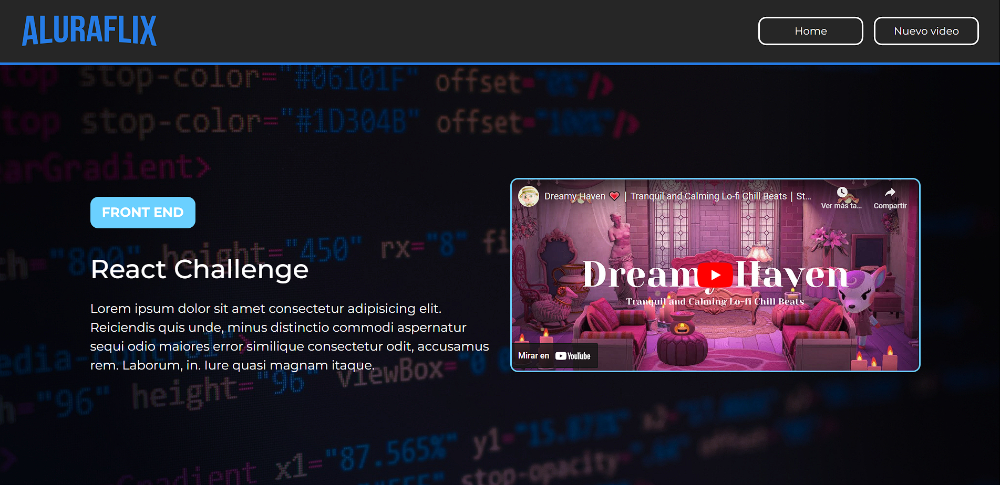

# 🎥 Aluraflix

**Aluraflix** es una aplicación web interactiva que permite a los usuarios agregar, editar y eliminar videos (en formato de cards) categorizadas de manera sencilla y eficiente. Este proyecto fue desarrollado como parte de mi aprendizaje con react

### 🌐 Demo 🌐

_Puedes ver la demostración del proyecto en el siguiente enlace_

-   [Demo](https://alura-flix-eta-pink.vercel.app/)

## 🛠️ **Tecnologías utilizadas**

-   **HTML5**: Estructura semántica y organizada.
-   **JavaScript (ES6+)**: Interactividad y lógica del proyecto.
-   **React**: Construcción de componentes y manejo del estado.
-   **React Router**: Navegación fluida entre las páginas de la aplicación.
-   **Tailwind CSS**: Diseño responsivo y estilización rápida.
-   **MockAPI**: Simulación de una API para la gestión de datos.

## ✨ **Características principales**

-   **Gestión de videos:**

    -   Agregar nuevos videos con información personalizada.
    -   Editar los detalles de las tarjetas de video existentes.
    -   Eliminar tarjetas de videos cuando ya no sean necesarias.

-   **Categorías dinámicas:**

    -   Clasificación de videos por categorías para mejor organización.

-   **Interfaz intuitiva:**
    -   Diseño moderno y atractivo, optimizado para usuarios de cualquier dispositivo.
